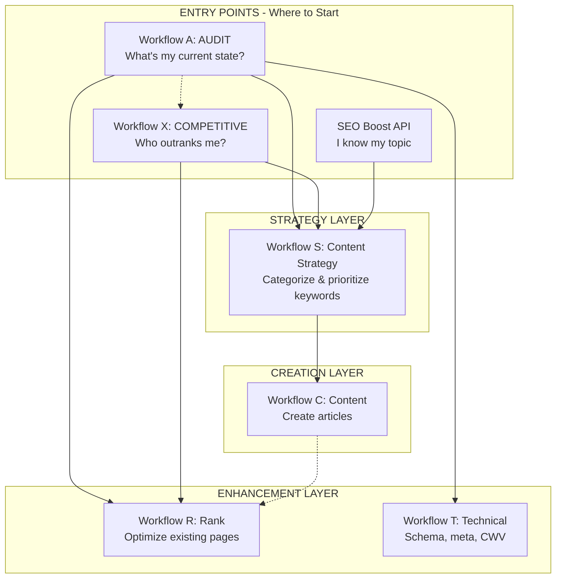

# SEO Skill Overview

Complete SEO system for keyword research, content generation, rank optimization, and technical implementation. Includes psychological copywriting frameworks for human-quality content that ranks.

**Think of it as:** An SEO agency in a box. Research, create, optimize, and measure - all orchestrated through structured workflows.

---

## When to Use This Skill

**Use this skill when:**

- User needs keyword research for a topic/niche
- User wants to create SEO-optimized content
- User has existing content that needs rank improvement
- User needs technical SEO implementation guidance
- User wants to audit their current SEO position
- User mentions "SEO", "keywords", "ranking", "SERP", "organic traffic"

**Skip to specific workflow when:**

- User has a specific task ("research keywords for X", "optimize this page")
- User knows exactly which workflow they need
- User is continuing work from a previous workflow

---

## The Workflow System

### Core Workflows

| Workflow       | Purpose                          | Input                        | Output                                                    |
| -------------- | -------------------------------- | ---------------------------- | --------------------------------------------------------- |
| **Workflow A** | SEO Audit & Opportunity Analysis | Site URL, business context   | Positioning gaps, content inventory, KICP recommendations |
| **Workflow X** | Competitive Intelligence         | Site URL, niche, competitors | SOV analysis, gap identification, monitoring setup        |
| **Workflow S** | Content Strategy                 | SEO Boost API JSON response  | Categorized clusters, content ideas, prioritized plan     |
| **Workflow C** | Content Generation               | Content idea from Workflow S | Publication-ready SEO article                             |
| **Workflow R** | Rank Enhancement                 | Existing content URL         | Optimized content for striking distance keywords          |
| **Workflow T** | Technical SEO                    | Site/page context            | Schema, meta tags, redirects, Core Web Vitals fixes       |

### Supporting Resources

| Resource                               | Purpose                                     |
| -------------------------------------- | ------------------------------------------- |
| **prioritization-framework.md**        | Strategic decision layer for SEO priorities |
| **experiments-tracker.md**             | Testing methodology for SEO changes         |
| **content-brief-template.md**          | Handoff format for human writers            |
| **references/seo-master-reference.md** | Consolidated SEO reference guide            |

---

## Entry Points & Workflow Selection

### Three Entry Points

```
                         ┌─────────────────────────────────────┐
                         │         WHERE DO I START?           │
                         └─────────────────────────────────────┘
                                          │
          ┌───────────────────────────────┼───────────────────────────────┐
          │                               │                               │
          ▼                               ▼                               ▼
┌───────────────────┐           ┌───────────────────┐           ┌───────────────────┐
│   WORKFLOW A      │           │   WORKFLOW X      │           │   SEO BOOST API   │
│      AUDIT        │           │   COMPETITIVE     │           │    + WORKFLOW S   │
│                   │           │   INTELLIGENCE    │           │                   │
│ "What's my        │           │ "Who outranks me  │           │ "I know my topic, │
│  current state?"  │           │  and why?"        │           │  need keywords"   │
└───────────────────┘           └───────────────────┘           └───────────────────┘
          │                               │                               │
          │                               │                               │
          ▼                               ▼                               ▼
┌─────────────────────────────────────────────────────────────────────────────────┐
│                         WORKFLOW S: CONTENT STRATEGY                            │
│                    (Categorize, cluster, prioritize keywords)                   │
└─────────────────────────────────────────────────────────────────────────────────┘
                                          │
                                          ▼
┌─────────────────────────────────────────────────────────────────────────────────┐
│                         WORKFLOW C: CONTENT CREATION                            │
│                       (Create publication-ready articles)                       │
└─────────────────────────────────────────────────────────────────────────────────┘

┌─────────────────────────────────────────────────────────────────────────────────┐
│                    ENHANCEMENT & TECHNICAL (Existing Content)                   │
├─────────────────────────────────────┬───────────────────────────────────────────┤
│         WORKFLOW R: RANK            │          WORKFLOW T: TECHNICAL            │
│     (Page-level optimization)       │      (Schema, meta, CWV fixes)            │
└─────────────────────────────────────┴───────────────────────────────────────────┘
```

### Choosing Your Entry Point

| Start Here           | When You...                              | What You Get                                       |
| -------------------- | ---------------------------------------- | -------------------------------------------------- |
| **Workflow A**       | Need a full SEO health check             | Gaps, inventory, priorities across your whole site |
| **Workflow X**       | Want to understand competitive landscape | SOV score, competitor gaps, monitoring setup       |
| **API + Workflow S** | Already know your topic, need keywords   | 300-450 keywords organized into content plan       |

### A vs X: The Key Distinction

| Aspect               | Workflow A (Audit)               | Workflow X (Competitive)          |
| -------------------- | -------------------------------- | --------------------------------- |
| **Focus**            | Your site holistically           | You vs competitors                |
| **Question**         | "Where am I?"                    | "Who beats me and why?"           |
| **Competitor depth** | One pillar of three              | Entire workflow dedicated         |
| **Output**           | Site-wide recommendations        | Competitive strategy + monitoring |
| **When to use**      | Starting SEO, quarterly checkups | Competitor threats, gap hunting   |

### Workflow Connections

**From Workflow A:**

- New content needed → API + Workflow S → Workflow C
- Existing content underperforming → Workflow R
- Technical issues found → Workflow T
- Need competitive deep-dive → Workflow X

**From Workflow X:**

- Gap keywords identified → Workflow S → Workflow C
- Page benchmarks needed → Workflow R
- Competitor technical advantages → Workflow T

**From API + Workflow S:**

- Content ideas ready → Workflow C
- Striking distance keywords → Workflow R

---

## System Architecture



## Workflow Dependencies

```
┌─────────────────────────────────────────────────────────────────────────────┐
│                         ENTRY POINTS (Choose One)                           │
├─────────────────────┬─────────────────────┬─────────────────────────────────┤
│    Workflow A       │    Workflow X       │    SEO Boost API                │
│    AUDIT            │    COMPETITIVE      │    KEYWORD DISCOVERY            │
│                     │    INTELLIGENCE     │                                 │
│ "Full SEO checkup"  │ "Competitor focus"  │ "I know my topic"               │
└─────────────────────┴─────────────────────┴─────────────────────────────────┘
          │                     │                         │
          │                     │                         │
          ▼                     ▼                         ▼
┌─────────────────────────────────────────────────────────────────────────────┐
│                    STRATEGY LAYER                                           │
│    workflow-s-content-strategy (Categorize, cluster, prioritize)            │
└─────────────────────────────────────────────────────────────────────────────┘
                                    │
                                    ▼
┌─────────────────────────────────────────────────────────────────────────────┐
│                    CREATION LAYER                                           │
│    workflow-c-content (Create publication-ready articles)                   │
└─────────────────────────────────────────────────────────────────────────────┘
                                    │
          ┌─────────────────────────┴─────────────────────────┐
          ▼                                                   ▼
┌───────────────────────────────┐       ┌─────────────────────────────────────┐
│      ENHANCEMENT LAYER        │       │         TECHNICAL LAYER             │
│  workflow-r-rank              │       │  workflow-t-technical               │
│  (Striking distance, refresh) │       │  (Schema, meta, redirects, CWV)     │
└───────────────────────────────┘       └─────────────────────────────────────┘
                                    │
                                    ▼
┌─────────────────────────────────────────────────────────────────────────────┐
│                    MEASUREMENT LAYER                                        │
│    experiments-tracker (Test, measure, iterate)                             │
└─────────────────────────────────────────────────────────────────────────────┘

ENTRY POINT OUTPUTS:
├── Workflow A outputs: content gaps, technical issues, competitor context
├── Workflow X outputs: SOV score, keyword gaps, content gaps, backlink gaps
└── API outputs: 300-450 keywords with metrics

CROSS-WORKFLOW CONNECTIONS:
├── A can trigger X (for deeper competitive analysis)
├── X feeds S (gap keywords become content priorities)
├── X feeds R (competitor benchmarks for page optimization)
├── S feeds C (content ideas become articles)
├── C feeds R (new content may need optimization later)
└── Any workflow can trigger T (technical issues found anywhere)
```

---

## Pre-Built Workflow Sequences

### Sequence 1: "Starting SEO From Zero"

**Situation:** New site/topic, need complete SEO foundation.

```
1. workflow-a-audit.md
   |-- Establish baseline, identify gaps
   |-- Input: Site URL, business context

2. SEO Boost API Call
   |-- Discover keyword opportunities
   |-- Input: Primary keyword from audit

3. workflow-s-content-strategy.md
   |-- Categorize and prioritize keywords
   |-- Input: API JSON response

4. workflow-c-content.md (repeat for priority keywords)
   |-- Create optimized content
   |-- Input: Content ideas from Workflow S

5. experiments-tracker.md
   |-- Set up measurement framework
```

---

### Sequence 2: "I Have Keywords, Need Content"

**Situation:** Already know target keywords, need content creation.

```
1. workflow-c-content.md
   |-- Input: Keyword + title + description
   |-- Specify tier: Compact (500-700) | Standard (1200-1600) | Comprehensive (2200-2800) | Authority (3000-3500+)
```

---

### Sequence 3: "Improve Existing Content"

**Situation:** Have content that's ranking poorly or in striking distance.

```
1. workflow-a-audit.md (optional)
   |-- Identify which content to prioritize

2. workflow-r-rank.md
   |-- Optimize for striking distance keywords
   |-- Input: Content URL + target keywords
```

---

### Sequence 4: "Technical SEO Fixes"

**Situation:** Need schema, meta tags, redirects, or Core Web Vitals improvements.

```
1. workflow-t-technical.md
   |-- Implementation guidance for specific issue
   |-- Input: Site context + specific technical need
```

---

### Sequence 5: "Complete SEO Audit"

**Situation:** Comprehensive analysis before major SEO investment.

```
1. workflow-a-audit.md
   |-- Three Pillars analysis
   |-- KICP decision tree

2. prioritization-framework.md
   |-- Strategic prioritization of opportunities

3. experiments-tracker.md
   |-- Set up testing framework for changes
```

---

### Sequence 6: "Competitive Intelligence"

**Situation:** Need to understand competitive landscape, find gaps, or set up monitoring.

```
1. workflow-x-competitive-intelligence.md
   |-- Share of Voice calculation
   |-- Keyword, content, backlink gap analysis
   |-- RADAR response framework
   |-- Input: Site URL, niche, known competitors (optional)

2. prioritization-framework.md (optional)
   |-- ICE scoring for gap opportunities

3. workflow-s-content-strategy.md (for gap keywords)
   |-- Turn competitive gaps into content plan
```

---

## Copywriting Enhancement (Workflow C)

Workflow C includes psychological copywriting methodology:

**Framework Selection (based on content type):**

- Pain-point content -> PAS (Problem-Agitation-Solution)
- Long-form guides -> PASTOR (Problem-Amplify-Story-Transformation-Offer-Response)
- Comparison content -> Feature-Benefit with BAB bridges
- Question content -> Direct answer + PAS expansion

**Humanization Checklist (applied before final polish):**

- [ ] Specific person with specific viewpoint (not committee voice)
- [ ] Real experience showing through (stories, mistakes, specific numbers)
- [ ] Opinions defended with reasoning (not hedged)
- [ ] Unique insight or data present
- [ ] Voice recognizable without byline

---

## Intake: Qualifying Questions

### Question 1: What's your current SEO state?

```
A) Starting from zero (new site/topic)
B) Have some content, need more
C) Have content that's not ranking well
D) Technical SEO issues
E) Need comprehensive audit
F) Need to analyze my competitors
G) Not sure / need help figuring it out
```

**Routing:**

- A -> Sequence 1 (Starting From Zero)
- B -> API Call -> Workflow S -> Workflow C
- C -> Sequence 3 (Improve Existing)
- D -> Sequence 4 (Technical Fixes)
- E -> Sequence 5 (Complete Audit)
- F -> Sequence 6 (Competitive Intelligence)
- G -> Continue to Question 2

### Question 2: What do you have ready?

```
[ ] Primary keyword/topic identified
[ ] Keyword research completed
[ ] Content strategy/priorities defined
[ ] Existing content to optimize
[ ] Technical issues identified
```

**Routing:** Fill gaps in order (Audit -> Discovery -> Organization -> Generation)

### Question 3: What's your immediate need?

```
A) Research keywords for a topic
B) Create new content
C) Improve existing content rankings
D) Fix technical SEO issues
E) Strategic planning/prioritization
F) Analyze competitors / find gaps
```

**Routing:**

- A -> SEO Boost API Call -> Workflow S
- B -> Workflow C (Content)
- C -> Workflow R (Rank)
- D -> Workflow T (Technical)
- E -> Prioritization Framework + Workflow A
- F -> Workflow X (Competitive Intelligence)

---

## SEO Boost API

The SEO Boost API provides keyword discovery integrated into the product.

**API Endpoint:**

```json
POST /api/v1/seo
{
  "keyword": "your keyword here",
  "serp_depth": 50,
  "ideas_limit": 200,
  "related_limit": 200,
  "suggestions_limit": 200,
  "location_name": "United States",
  "language_code": "en"
}
```

**What It Does:**

- Returns 300-450 keywords with metrics
- 90%+ token reduction vs raw API responses
- ~$0.30-0.40 per research run

**If API not available:** Use manual keyword research with web search tools.

---

## Performance Metrics

| Workflow            | Time        | Output                       | Token Efficiency                    |
| ------------------- | ----------- | ---------------------------- | ----------------------------------- |
| **API Discovery**   | 46 seconds  | 300-450 keywords             | 90%+ reduction (20K vs 130K tokens) |
| **W-S: Strategy**   | 2-5 minutes | Clusters + 24+ content ideas | Markdown-native (no API bloat)      |
| **W-C: Generation** | 3-5 minutes | Publication-ready article    | Web search for real-time SERP       |

**Total pipeline:** ~10 minutes from keyword to published article

**Cost:** ~$0.30-0.40 per API research run

---

## Key Innovations

1. **API-Integrated Discovery** - Single API call returns optimized keyword data with 90%+ token reduction
2. **Markdown-Native Pipeline** - All outputs are portable markdown artifacts (no vendor lock-in)
3. **Hub/Spoke Architecture** - 1 hub + 3 spokes per cluster = topical authority structure
4. **Flexible Tiers** - 4 word count options (500-3500+) with dynamic component proportions
5. **Copywriting Frameworks** - Psychological copywriting (PAS/PASTOR/BAB) + humanization patterns

---

## Quick Routing Reference

### By Goal

| Goal                 | First Step                          | Then                        | Then                 |
| -------------------- | ----------------------------------- | --------------------------- | -------------------- |
| Find keywords        | SEO Boost API Call                  | workflow-s-content-strategy | workflow-c-content   |
| Create content       | workflow-c-content                  | -                           | -                    |
| Improve rankings     | workflow-r-rank                     | -                           | -                    |
| Fix technical issues | workflow-t-technical                | -                           | -                    |
| Full SEO strategy    | workflow-a-audit                    | prioritization-framework    | appropriate workflow |
| Analyze competitors  | workflow-x-competitive-intelligence | workflow-s (for gaps)       | workflow-c-content   |

### By What's Missing

| Missing                            | Run This                            |
| ---------------------------------- | ----------------------------------- |
| Don't know what keywords to target | SEO Boost API -> Workflow S         |
| Have keywords, need prioritization | workflow-s-content-strategy         |
| Need to create new content         | workflow-c-content                  |
| Content not ranking well           | workflow-r-rank                     |
| Technical SEO problems             | workflow-t-technical                |
| Don't know where to start          | workflow-a-audit                    |
| Need competitor intelligence       | workflow-x-competitive-intelligence |
| Want to find competitive gaps      | workflow-x-competitive-intelligence |

---

## Content Tier Guidelines

Workflow C supports flexible word counts:

| Tier              | Words      | Use Case                                      |
| ----------------- | ---------- | --------------------------------------------- |
| **Compact**       | 500-700    | Quick Wins, Intent Signals, tactical posts    |
| **Standard**      | 1200-1600  | Authority Builders, detailed how-to guides    |
| **Comprehensive** | 2200-2800  | Deep dives, multi-section guides              |
| **Authority**     | 3000-3500+ | Hub articles, ultimate guides, pillar content |

**Default:** Compact (500-700 words) if not specified.

---

## The SEO Specialist Agent

For automated keyword research, use the `seo-specialist` agent:

```
Agent: seo-specialist
Purpose: Automated keyword research via SEO Boost API

Workflow:
1. SEO Boost API Call - Get keyword data
2. Workflow S (Content Strategy) - Strategic analysis

Output: Content strategy markdown file in .claude/seo-research/
```

**When to use agent vs manual:**

- **Agent:** Automated research, batch processing
- **Manual workflows:** Step-by-step control, learning, customization

---

## Anti-Patterns

### Don't:

- Skip Workflow A audit for established sites (you'll miss opportunities)
- Run Workflow C without voice/positioning defined (content will be generic)
- Ignore Workflow R for existing content (fastest ROI activity)
- Skip humanization checklist (content will read as AI-generated)
- Batch Workflow C outputs without review (quality varies)

### Do:

- Start with audit for established sites
- Prioritize Workflow R for quick wins on existing content
- Apply humanization checklist to every piece
- Review and polish each Workflow C output

---

## Quality Gate

Before publishing any Workflow C output, verify:

1. **E-E-A-T signals present** - Experience, Expertise, Authority, Trust
2. **Copywriting framework applied** - PAS/PASTOR/BAB structure
3. **Human patterns evident** - Specific viewpoint, real examples, clear voice
4. **Keyword integration natural** - Not stuffed, contextually appropriate
5. **Tier word count met** - Within specified range

---

## The Test

Good SEO workflow execution means:

1. **User knows where to start** (clear routing)
2. **Workflows run in logical order** (dependencies respected)
3. **Outputs feed into next workflow** (no wasted work)
4. **Content is human-quality** (passes E-E-A-T check)
5. **Results are measurable** (experiments tracker in place)

If content reads as AI-generated after Workflow C, the humanization stage failed.
